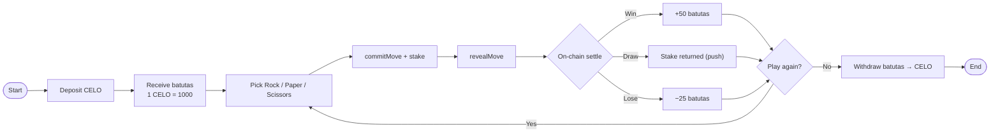
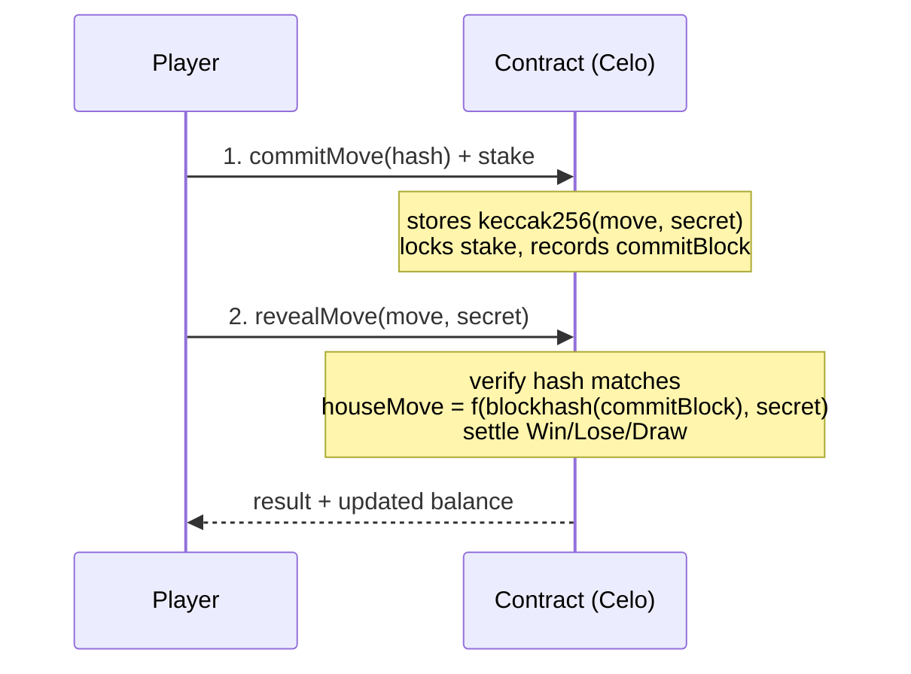
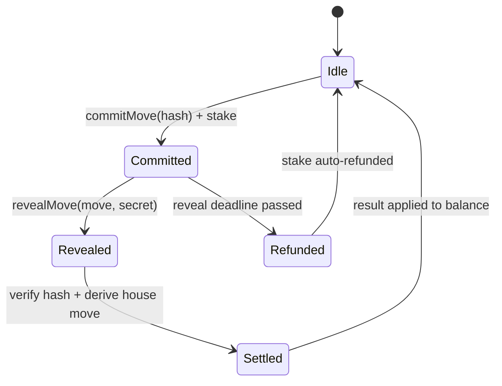
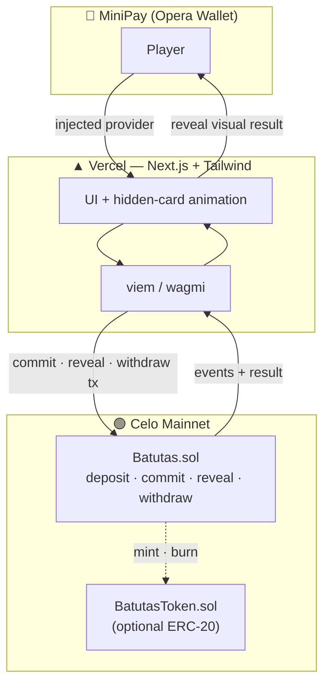

<p align="center">
  <picture>
    <source media="(prefers-color-scheme: dark)" srcset="./logo-bg.png">
    
  </picture>
</p>

<h1 align="center">🪨📄✂️ BATUTAS</h1>

<p align="center">
  <b>A provably-fair, on-chain Rock–Paper–Scissors (RPS) mini-game built for MiniPay on Celo Mainnet.</b>
  <br/>
  Deposit CELO, play instantly, withdraw anytime — every move is settled and verifiable on-chain.
</p>

<p align="center">
  
  
  
  
</p>

> ℹ️ **`BATUTAS`** is named after **Batu–Gunting–Kertas** — the Indonesian Rock–Paper–Scissors hand game (locally called *suit*). "Batutas" is also the name of the in-game currency you earn, stake, and withdraw.

---

## ✨ Overview

**BATUTAS** is a lightweight, mobile-first game where a player challenges the protocol in Rock–Paper–Scissors. The on-screen choice spins continuously (hidden behind a card) until the player locks in a move — but the **actual outcome is decided on-chain using a provably-fair commit–reveal scheme**, so neither the player nor the house can cheat.

- 💸 **Deposit** CELO → receive in-game **batutas**
- 🎮 **Play** RPS against the protocol, instantly
- 🏆 **Win** batutas, accumulate balance
- 💰 **Withdraw** batutas back to CELO at any time

Everything runs on **Celo Mainnet** and is optimized for **MiniPay** (Opera's self-custodial wallet, 14M+ users).

---

## 🎯 Problem & Value Proposition

| | |
|---|---|
| **Problem** | Most "web3 games" are demos with no real users, opaque randomness, and no clear money flow. Players don't trust the outcome. |
| **Solution** | A dead-simple, universally-understood game (RPS) with **transparent, verifiable fairness** and a frictionless MiniPay deposit/withdraw flow. |
| **Why it wins** | Real, repeatable on-chain transactions from real users → exactly the activity Celo's *Proof of Ship* rewards. Low cognitive load = high retention. |

---

## 🧩 Features

- 🔐 **Provably fair** outcomes via commit–reveal (VRF-ready for production)
- ⚡ **One-tap UX** designed for MiniPay
- 🪙 **In-app batutas balance** pegged transparently to CELO
- 📊 **On-chain game history** — every round is auditable
- 📱 **Responsive, mobile-first** UI
- 🧪 Full **testnet → mainnet** deployment path

---

## 🔄 How It Works

### Player flow

```
Deposit CELO ──▶ Receive batutas ──▶ Pick R/P/S ──▶ On-chain settle ──▶ Win/Lose/Draw ──▶ Withdraw
```

Detailed end-to-end journey:



### Batutas economy (recommended, balanced)

> ⚠️ The original draft used **play = 25, win = 30**, which produces a **~27% house edge** — far too steep for player retention. The table below is a rebalanced, near-fair economy. Tune the numbers in the contract to your goal.

| Action | Batutas | CELO equivalent (peg 1 CELO = 1000 batutas) |
|---|---:|---|
| Deposit 1 CELO | +1000 | 1.000 CELO |
| Cost per play (stake) | −25 | 0.025 CELO |
| **Win** payout | **+50** | 0.050 CELO |
| **Draw** | stake returned (push) | 0.000 CELO |
| **Lose** | 0 | −0.025 CELO |
| Withdraw 1000 batutas | −1000 | 1.000 CELO |

**Expected value (P(win)=P(lose)=P(draw)=⅓, draw = push):**

```
EV = (+25  +  0  −25) / 3 = 0 batutas per play   →  ~fair game
```

To stay sustainable, set the win payout slightly below 2× (e.g. **+47/+48**) to keep a small **3–5% house rake** that funds the prize reserve and gas without bleeding players dry.

> 💡 **Design note:** the "continuous shuffle then stop" animation is **frontend-only UX sugar**. It does **not** determine the result — the smart contract does, via the commit–reveal flow below.

---

## 🎲 Provably-Fair Randomness

On a public blockchain, *everything the contract knows is public*, so the house can't simply "keep a secret." We use **commit–reveal** so that:

- the player can't change their move after seeing the house move, and
- the house can't react to the player's move.

### Flow (MVP — commit–reveal)



1. **Commit** — player submits `keccak256(abi.encodePacked(move, secret))` plus the stake. The chain has not yet produced `blockhash(commitBlock)`.
2. **Reveal** — player submits `move` + `secret`. The contract verifies the hash, then derives the **house move** from `blockhash(commitBlock)` combined with the player's `secret`. Neither party could predict or grind this in advance.

### Round lifecycle (state machine)



> 🔒 **For real-money mainnet:** block-hash randomness is acceptable for low stakes but is theoretically grindable by block producers. **Upgrade to a Verifiable Random Function (VRF)** before handling meaningful value. (Confirm current VRF/oracle availability on Celo's L2 mainnet during the integration step.)

### Frontend illusion vs. on-chain truth

| Layer | Responsibility |
|---|---|
| **Frontend** | Spins the hidden card animation while the reveal tx is pending; reveals the visual result *after* the contract confirms. |
| **Contract** | Sole source of truth for the outcome. The animation must always match the on-chain result, never precede it. |

---

## 🏗️ Architecture

```
batutas/
├── packages/
│   ├── hardhat/                # Smart contracts + tests + deploy scripts
│   │   ├── contracts/
│   │   │   ├── Batutas.sol      # core game (deposit, commit, reveal, withdraw)
│   │   │   └── BatutasToken.sol # optional ERC-20 batutas (or track balances internally)
│   │   ├── test/
│   │   └── deploy/
│   └── react-app/              # Next.js frontend (MiniPay-optimized)
│       ├── components/
│       ├── hooks/
│       └── lib/                # viem / wagmi config
├── .env.example
└── README.md
```

### System flow



---

## 🛠️ Tech Stack

| Layer | Choice | Notes |
|---|---|---|
| Scaffold | **Celo Composer** | Hackathon-friendly starter (Next.js + Hardhat + Vercel) |
| Contracts | **Solidity + Hardhat** | Deployed & **verified** on Celo Mainnet |
| Web3 lib | **viem / wagmi** | ⚠️ **Do NOT use ethers.js** — it does not work inside MiniPay |
| Frontend | **Next.js + Tailwind** | Mobile-first |
| Wallet | **MiniPay** | `useConnect` injected connector; implement the MiniPay hook (Proof of Ship **booster**) |
| Hosting | **Vercel** | |

---

## 📜 Smart Contract Interface (draft)

```solidity
enum Move { Rock, Paper, Scissors }
enum Result { Lose, Draw, Win }

// --- Funds ---
function deposit() external payable;              // CELO in → batutas credited (1 CELO = 1000 batutas)
function withdraw(uint256 batutas) external;      // batutas → CELO out

// --- Game (commit–reveal) ---
function commitMove(bytes32 commitHash) external; // locks stake (e.g. 25 batutas)
function revealMove(Move move, bytes32 secret) external returns (Result);

// --- Views ---
function balanceOf(address player) external view returns (uint256 batutas);
function pendingCommit(address player) external view returns (bytes32 hash, uint256 block_);

// --- Admin (timelocked / multisig recommended) ---
function setStake(uint256 batutas) external;      // onlyOwner
function setWinPayout(uint256 batutas) external;  // onlyOwner
function fundReserve() external payable;            // top up payout pool
```

**Safety checklist for the contract**
- ✅ `nonReentrant` on `withdraw` / settlement
- ✅ Pull-over-push payouts where possible
- ✅ Reveal **deadline** (auto-refund stake if player never reveals)
- ✅ Maintain a **reserve invariant**: `reserve ≥ maxConcurrentExposure` so wins are always payable
- ✅ Events for every state change (`Deposited`, `Committed`, `Revealed`, `Withdrawn`) for analytics & Proof of Ship tracking
- ✅ Get **audited** before any real-money launch

---

## 🚀 Getting Started

### Prerequisites
- Node.js ≥ 18
- A wallet with a little CELO for gas (**use a throwaway dev wallet — never your main funds**)
- MiniPay (for mobile testing)

### 1. Scaffold with Celo Composer
```bash
npx @celo/celo-composer@latest create
cd batutas
yarn install   # or npm install
```

### 2. Environment
```bash
cp .env.example .env
```
```dotenv
# .env
PRIVATE_KEY=your_dev_wallet_private_key   # throwaway wallet only!
CELOSCAN_API_KEY=your_celoscan_key        # for contract verification
NEXT_PUBLIC_CONTRACT_ADDRESS=             # filled after deploy
```

### 3. Test locally
```bash
cd packages/hardhat
npx hardhat test
```

### 4. Run the frontend
```bash
cd packages/react-app
yarn dev
# open http://localhost:3000  (test inside MiniPay's dApp browser for the real flow)
```

---

## 🌐 Deployment — Celo Mainnet

> Test on **Celo Sepolia** first. Get testnet CELO/USDC from the Celo faucet. Remember: in MiniPay you pay **gas in cUSD**.

**Network config**

| | Mainnet | Sepolia (testnet) |
|---|---|---|
| Chain ID | `42220` | (per current Celo docs) |
| RPC | `https://forno.celo.org` | (per current Celo docs) |
| Explorer | Celoscan | Celoscan testnet |

> Verify the exact testnet chain ID/RPC against the latest Celo docs at deploy time — Celo now runs as an Ethereum L2 and endpoints can change.

```bash
cd packages/hardhat
npx hardhat run deploy/deploy.ts --network celo
# verify so it's eligible for Proof of Ship:
npx hardhat verify --network celo <CONTRACT_ADDRESS> <constructor_args>
```

Then set `NEXT_PUBLIC_CONTRACT_ADDRESS` and deploy the frontend to Vercel.

---

## 📲 MiniPay Integration

- Detect MiniPay and auto-connect the injected provider (no connect button needed inside MiniPay).
- Use **viem/wagmi** only.
- Keep transactions single-tap and cheap; show clear pending/confirmed states tied to the card animation.
- Implementing the **MiniPay hook** is no longer mandatory but counts as a **Booster** in your Proof of Ship score.

---

## ⚠️ Risk & Compliance Notice

Rock–Paper–Scissors against the protocol is a **game of chance**, not skill. Combined with real-value deposits and withdrawals, this can fall under **gambling / online-betting regulation**, which varies by country and is **prohibited in some jurisdictions (including Indonesia)**. The Proof of Ship guidelines also flag that *managing user funds requires audits and regulatory awareness*.

Before any real-money mainnet launch, consider:
- 🧭 Checking the legal status of money games in your **target users' countries**.
- 🎮 A **PvP** model (player-vs-player with a small protocol rake) instead of player-vs-house — generally framed more as a "game" than as a house/bookmaker.
- 🪙 Launching first with **play-money / testnet** or **non-cash rewards** to validate engagement.
- 🔍 A **smart-contract audit** before holding meaningful value.

This README is technical documentation, not legal advice.

---

## 🗺️ Roadmap (mapped to Proof of Ship's monthly rhythm)

| Week | Theme | Goal |
|---|---|---|
| **1 — Scope** 💡 | Lock economy & fairness model; wireframes (Figma) | Spec + commit-reveal design finalized |
| **2 — Ship** ⚡ | Contracts on Sepolia + working frontend | Playable demo, build in public |
| **3 — Refine** 🔍 | Deploy & verify on mainnet, add analytics, gather feedback | Real users, real txs |
| **4 — Present** 📢 | Polish UX, record 4-min demo, define growth | Final leaderboard snapshot |

**Future**
- [ ] VRF-based randomness
- [ ] PvP / tournament mode
- [ ] Leaderboard & streak rewards
- [ ] Daily free play to drive retention

---

## ✅ Proof of Ship Eligibility Checklist

- [ ] Deployed on **Celo Mainnet** with **verified** smart contracts
- [ ] **Open-source** public GitHub repo (private repos also supported for tracking)
- [ ] At least one Celo smart contract linked on the project
- [ ] Builder profile + project created on **talent.app**, registered for the active campaign
- [ ] **MiniPay hook** implemented (Booster)
- [ ] Real onchain activity from real users (txs, fees, unique users)
- [ ] Project leader can claim rewards via MiniPay

---

## 📄 License & IP

Released under the **MIT License**. The code is the intellectual property of the team; it is open-sourced so it can be tracked and evaluated on the Proof of Ship Leaderboard.

---

## 🔗 Links

- Project demo: _coming soon_
- Talent App profile: _add link_
- Celo Docs: https://docs.celo.org/
- Celopedia: https://celopedia.celo.org/

---

<p align="center"><i>Built for Celo Proof of Ship — Season 2.</i></p>
